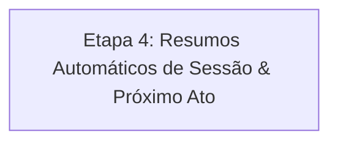

# 🗡️ Plano de Entrega do MVP — SoloForge

> **Objetivo do MVP**: Permitir que um jogador crie uma crônica, converse com o Mestre IA (Gemini), veja as consequências serem registradas na memória do mundo, gerencie NPCs descobertos e role dados sem sair do chat.

---

## 📊 Status Atual (Atualizado)

| Camada / Feature | Status | Detalhes |
|---|:---:|---|
| **Infra & Deploy** | ✅ **Concluído** | Backend no Render (Docker), DB no Neon DB (PostgreSQL 16) e Frontend na Vercel. |
| **Schema & Entidades** | ✅ **Concluído** | Campaign, Bible, System, Session, Message, NPC, WorldDecision, StoryArc. |
| **CRUD de Campanha** | ✅ **Concluído** | Criação de campanha, inicialização da Bíblia e do Sistema de Regras. |
| **Chat Básico & Gemini** | ✅ **Concluído** | Envio de mensagens com injeção de contexto mestre e histórico de mensagens. |
| **Árbitro de Regras & Rolagem de Dados** | ✅ **Concluído** | Validação de ações contra o sistema, DT prévia, tag `[PEDIR_TESTE]`, banner de rolagem e dados rápidos (d4 a d100). |
| **Arcos Narrativos & Memória do Mundo (Etapa 2)** | ✅ **Concluído** | Endpoints de Arcos e Decisões, abas no painel lateral direito, modal de criação rápida, toggle de conclusão e injeção no prompt do Mestre. |
| **Cristalização de NPCs (Etapa 3)** | ✅ **Concluído** | Endpoints completos de NPCs, alternância entre passageiro e cristalizado com badge visual, modal de cadastro e injeção automática no prompt contínuo do Gemini. |

---

## 🎯 A Última Etapa Restante para Fechar o MVP

---

### 📜 Etapa 4 — Resumos Automáticos de Sessão & Avanço de Ato
> *Permite campanhas longas divididas em episódios (Ato I, Ato II, etc.) de forma leve e organizada, economizando tokens e mantendo a coerência narrativa.*

- **O que falta**:
  1. **Endpoint de Conclusão de Sessão**:
     - `POST /api/sessions/{id}/conclude`: Dispara um prompt ao Gemini solicitando um resumo conciso dos fatos da sessão e grava no `Session.summary`.
  2. **Criação e Troca de Atos**:
     - Botão *"Encerrar Sessão & Iniciar Próximo Ato"* na interface.
     - Carrega o resumo das sessões anteriores no contexto da nova sessão limpa em vez de reenviar todo o histórico antigo.
