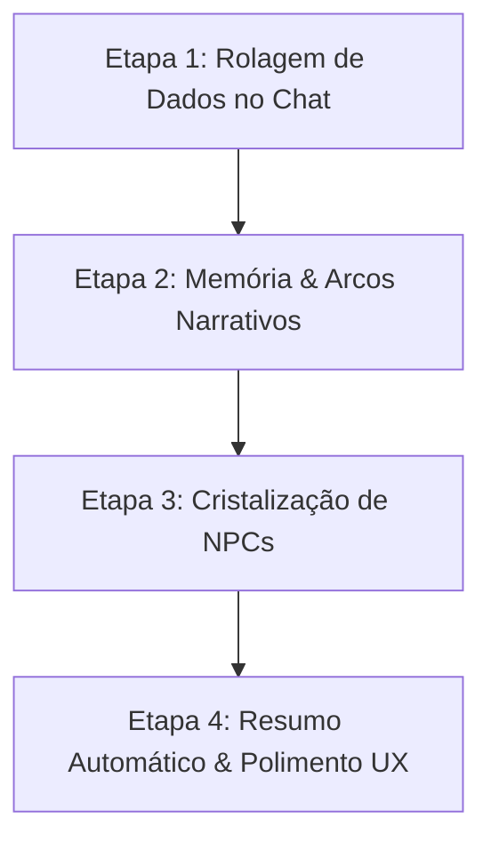

# 🗡️ Plano de Entrega do MVP — SoloForge

> **Objetivo do MVP**: Permitir que um jogador crie uma crônica, converse com o Mestre IA (Gemini), veja as consequências serem registradas na memória do mundo, gerencie NPCs descobertos e role dados sem sair do chat.

---

## 📊 Status Atual (O que já temos)

| Camada / Feature | Status | Detalhes |
|---|:---:|---|
| **Infra & Deploy** | ✅ **Concluído** | Backend no Render (Docker), DB no Neon DB (PostgreSQL 16) e Frontend na Vercel. |
| **Schema & Entidades** | ✅ **Concluído** | Campaign, Bible, System, Session, Message, NPC, WorldDecision, StoryArc. |
| **CRUD de Campanha** | ✅ **Concluído** | Criação de campanha, inicialização da Bíblia e do Sistema de Regras. |
| **Chat Básico & Gemini** | ✅ **Concluído** | Envio de mensagens com injeção de contexto mestre e histórico de mensagens. |

---

## 🎯 As 4 Etapas Faltantes para o MVP Completo

Para que o SoloForge seja um **verdadeiro RPG Solo com IA persistente** (e não apenas um chat comum), restam 4 entregas essenciais:

---

### 🎲 Etapa 1 — Rolagem de Dados Interativa no Chat (D4, D6, D8, D10, D12, D20, D100)
> *Sem dados e aleatoriedade, não há RPG de mesa!*

- **O que falta**:
  1. Componente na barra inferior do chat com botões rápidos de dados ou comando (ex: `/roll 1d20+3`).
  2. Mensagem do tipo `SYSTEM` no chat renderizada com design especial de dado (resultado com sucesso/falha visual).
  3. Envio do resultado da rolagem para o contexto da próxima resposta do Gemini para que o Mestre reaja ao valor rolado.

---

### 🧠 Etapa 2 — Registro de Decisões & Arcos Narrativos (Fase 2 do Roadmap)
> *Garantir que a IA lembre das ações passadas sem estourar limite de contexto.*

- **O que falta**:
  1. **Endpoints de Arcos e Decisões**:
     - `POST /api/campaigns/{id}/arcs` (Criar/atualizar progresso de missões)
     - `POST /api/campaigns/{id}/decisions` (Registrar escolhas e consequências que mudaram o mundo)
  2. **Abas no Painel Lateral**:
     - Adicionar abas na lateral direita do frontend: **[Bíblia]**, **[Missões/Arcos]**, **[Memória do Mundo]**.
  3. **Edição Rápida**:
     - Permitir ao jogador adicionar ou editar um marco histórico diretamente na tela durante a partida.

---

### 👥 Etapa 3 — Sistema de Cristalização de NPCs (Fase 3 do Roadmap)
> *O diferencial do SoloForge: NPCs que surgem na conversa podem virar personagens fixos.*

- **O que falta**:
  1. **API de NPCs**:
     - `GET /api/campaigns/{id}/npcs`
     - `POST /api/campaigns/{id}/npcs` (Criar manualmente ou salvar NPC)
     - `PUT /api/npcs/{id}/crystallize` (Alternar entre passageiro e cristalizado)
  2. **Botão de Ação Rápida no Chat**:
     - O jogador pode clicar com botão direito ou num botão de ação em um trecho da fala do Mestre: *"Cristalizar NPC"* (preenche nome e papel do personagem).
  3. **Injeção Ativa**:
     - O `ContextBuilderService` já está pronto para injetar NPCs cristalizados! Basta alimentá-lo pelo frontend.

---

### 📜 Etapa 4 — Fechamento de Sessão & Resumos Automáticos (Fase 4 do Roadmap)
> *Permitir jogar várias sessões sem perder o fio da meada.*

- **O que falta**:
  1. Botão **"Finalizar Sessão / Criar Próximo Ato"**:
     - Chama endpoint no backend que solicita ao Gemini: *"Gere um resumo em 3 tópicos desta sessão para registrar no diário da crônica"*.
     - Grava o resumo no campo `Session.summary`.
     - Inicia a próxima sessão limpa (Ato II), injetando o resumo anterior no contexto em vez de reenviar 50 mensagens antigas.

---

## ⏱️ Ordem de Execução Recomendada

1. **Etapa 1 (Rolador de Dados)**: Impacto imediato na jogabilidade (1 a 2 horas).
2. **Etapa 2 (Abas laterais de Arcos e Decisões)**: Torna a crônica viva e editável (2 horas).
3. **Etapa 3 (Painel e Cristalização de NPCs)**: Completa a proposta única de valor (2 a 3 horas).
4. **Etapa 4 (Resumo de Sessão / Próximo Ato)**: Fecha a experiência completa de ciclo de jogo (1 a 2 horas).
